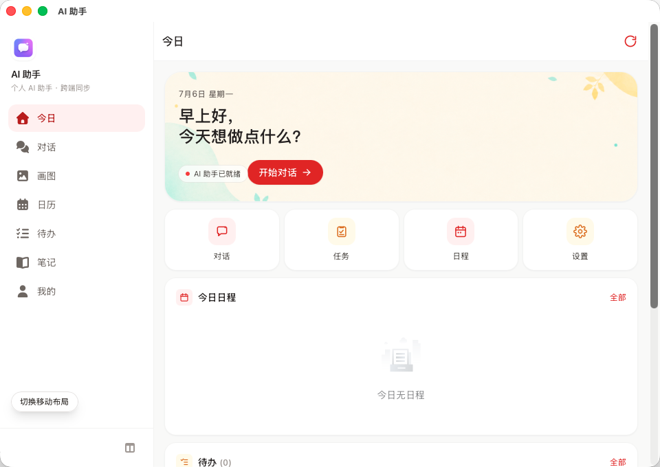
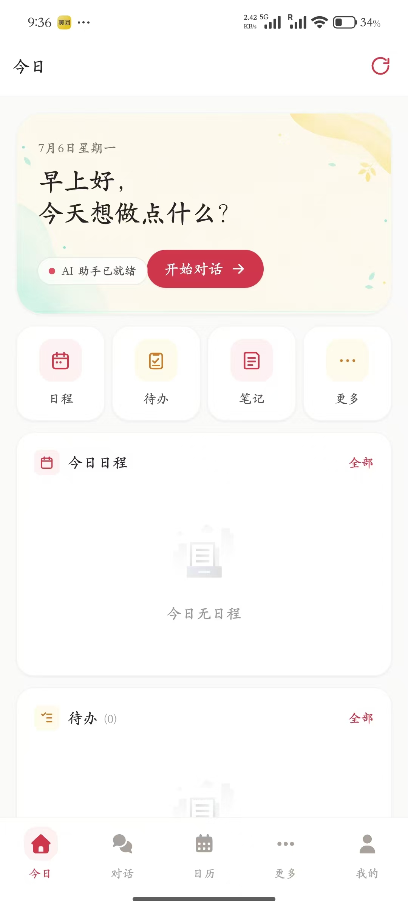

# AI 个人助手

Tauri + Vue 3 实现的个人助手应用，支持会话、待办、日程、日报、模型配置、画图、WebDAV 备份同步和 Cloudflare Workers 信令。

## 截图

| 桌面端 | 安卓端 |
| --- | --- |
|  |  |

## v0.0.18 更新

### 搜索

- 新增全局搜索页，支持搜索对话、笔记和画图记录；桌面端侧边栏、移动端「更多」页和首页均可进入。
- 首页新增 100% 宽度的全局搜索入口，放在快捷卡片上方。

### 同步

- 顶部同步按钮显示同步中、同步失败、未同步和最近同步时间，避免重复或误导性的同步提示。

### 日历

- 日历支持按日期手动编辑当日日志，并随 `user_prefs` 同步。
- 桌面端日历格子进一步压缩高度；无事件占位图缩小，页面更紧凑。

## v0.0.17 更新

### 画图

- 画图结果支持长按（移动端）/ 右键（桌面端）进入多选，删除时同时清掉本地文件，避免孤儿文件累积。

## v0.0.16 更新

### 笔记

- 移动端笔记列表操作按钮（新建、卡片/列表切换、多选删除）从导航栏挪到独立一行，多选删除不再遮挡底部 tabbar。

## v0.0.15 更新

### 画图

- **独立画图页**：从会话里抽出来，单次输入提示词 + 选模型 + 参考图，桌面端左右分栏，移动端单栏 + 折叠更多选项。
- **提示词优化**：加「✨ 优化提示词」按钮，把"想法"自动转成 Stable Diffusion 风格英文提示词，可手动编辑。
- **生成选项**：数量 1-4、标准/HD 分辨率、7 种宽高比（1:1 / 4:3 / 16:9 / 9:16 / 3:2 等）。
- **参考图区分接口**：有参考图走 `images/edits`，无参考图走 `images/generations`。
- **结果浏览**：点击放大预览，多图支持左右箭头/键盘左右键切换；预览底部"保存"按钮，桌面端弹保存框、移动端存到 `images/export/`。
- **会话恢复**：输入和结果持久化到 localStorage，重开页面自动恢复上次状态。

### 笔记

- **新增笔记板块**：桌面端侧边栏入口，移动端聚合到「更多」tab。
- **列表/卡片双视图**：卡片视图带 7 种颜色、4 种字体（宋体/楷体/等宽/默认）、4 种纸张背景（素白/米黄/网格/暗纹）。
- **多选删除**：长按或右键进入多选模式，删除二次确认；列表项也支持单条删除。
- **时间戳**：列表显示完整 `YYYY/MM/DD HH:MM`。

### 导航重构（移动端）

- 底部 tab 把「待办」替换成「更多」，避免 6 个 tab 拥挤。
- **更多页**聚合待办、笔记、画图等工具入口，卡片式布局。
- 首页快捷入口改为日程/待办/笔记/更多。
- 工具页（笔记/笔记编辑/待办/画图）移动端统一加返回按钮，桌面端继续走侧边栏。

### 会话

- 单条消息增加**复制**按钮（重新发送 / 复制 / 删除），操作按钮颜色加深。
- 多选模式支持**批量删除**。
- 会话级**模型下拉切换**（桌面 select / 移动 picker），不影响默认模型。
- 消息加**时间标签**：5 分钟内的连续消息合并显示时间，隔得久才重复显示。

### 同步

- **笔记表**纳入 WebDAV 同步范围。
- **主题、天气设置、信令 URL** 迁到 `user_prefs` 同步表；WebDAV 账号、设备 ID 仍按设备独立（不同步）。
- 信令 URL 配置去污染：`device` 参数在连接时才追加，配置项本身保持纯净。

### 日报

- **修复日程事件读不到**：之前用 UTC 拼接当天 00:00 / 24:00 边界，跨时区会漏；改用 `chrono::Local` 本地时区查询。

### 其它

- 桌面端月历单元格高度从正方形改为 80px，空间利用率更好。

## v0.0.14 更新

### 安卓

- AsyncImage 错误信息显示 src 链接前缀，便于定位图片加载失败的原因。

## v0.0.13 更新

### 天气

- **修复 Android 定位超时**：Android WebView 默认不弹原生定位权限框，导致 `navigator.geolocation` 一直挂到超时。新增 **IP 兜底定位**（ipapi.co）：GPS 5s 内拿不到位置时自动切到 IP 估算，城市级精度对天气足够。
- 桌面端浏览器有定位权限时仍走 GPS + 反查（BigDataCloud），精度不变。
- 定位结果 toast 区分来源：GPS 直接显示城市名，IP 兜底会带「（IP 估算）」尾标。

## v0.0.8 更新

### 安卓

- **大幅减小 APK 体积**：CI 切到 release 构建（R8 + Rust release profile + JS minify + strip 符号），并启用 ABI splits——每个架构单独出包，避免一份 APK 塞 4 套 Rust native 库。
- **按架构分包发布**：`arm64-v8a`（现代手机主流）/ `armeabi-v7a`（老设备）/ `x86_64` / `x86`（模拟器）/ `universal`（兜底）。下 Releases 时按手机 CPU 选 arm64-v8a 版本即可，体积约为 universal 的 25%。
- **release 签名**：复用 `.github/android/debug.keystore` 给 release variant 签名，通过 `apply from: "customizations.gradle"` 注入到 Tauri 生成的 gradle 工程，不动 Tauri 模板本身。
- 同一份证书同时签 debug 和 release，相互可覆盖升级。

## v0.0.7 更新

### 安卓

- 修复 debug 签名每次 CI 随机变化导致无法覆盖升级的问题：仓库内置固定 `debug.keystore`，CI 构建前安装到 `~/.android/debug.keystore`，gradle 默认 debug 签名自动复用同一份证书。
- 后续 debug 版本可以无缝覆盖升级，无需卸载重装。
- 后续若要正式分发（应用商店），需要自签 release keystore 并接入 CI signing 流程。

## v0.0.6 更新

### 安卓

- 修复安卓 APK 无法安装（"解析软件包时出现问题"）的问题：CI 改用 debug 签名构建，跳过未配置 keystore 的限制。

## v0.0.5 更新

### 对话

- 升级到 OpenAI 标准 tool calling（tool_calls / tools schema），保留本地执行。
- 工具调用面板：折叠展示参数和结果，状态图标 ⏳/🔧/⚠️，结果按 Markdown 渲染。
- 消息气泡 hover 显示「重新发送」和「删除」按钮。
- 删除消息后再点同步会强制覆盖远端（写入 sentinel 行让 `max(created_at)` 自动 bump）。
- 「新话题」分隔：旧消息保留但不进入后续上下文。
- 用户输入走纯文本，助手消息走 Markdown 渲染（github-markdown-css + github hljs）。
- 助手消息支持：Markdown、LaTeX 公式（自动把 `\[..\]` / `\(..\)` 转成 `$$..$$` / `$..$`）、Mermaid、PlantUML、代码高亮。
- 会话图片点击放大预览，支持滚轮缩放、双击切换、拖拽平移。
- 对话标题旁加 ⓘ 提示按钮，悬浮列出助理能力，备注文本模型需支持 tool calling。

### 画图

- 兼容 gpt-image-2：移除 `response_format`，强制 HTTP/1.1，超时延长到 180s。
- 画图模型设置页加蓝色提示卡：会话中说「画一个…」即可调用。
- 画图工具从「AI」板块移到「工具」板块。

### 天气

- 重写天气查询：拉取 current + hourly(24h) + daily(15d)。
- 输出 Markdown：标题 + 体感/湿度/风速/UV/日出日落 + 穿衣建议引用 + 24 小时表格 + 15 天表格，每行带天气 emoji。
- 新增「工具 → 天气工具」设置页：定位（反查 BigDataCloud）/ 手动输入城市，存到 local_kv。
- 定位被拒时提供「打开系统定位设置」按钮（macOS / Windows URL scheme）。
- LLM 工具调用没传 location 时回退到默认城市。

### 日历

- 当日事件下方新增「当日日报」卡片（摘要 + 完成/待办/事件 统计 + 跳转按钮）。
- 新增「本周周报」卡片（覆盖天数 X/7、统计聚合、首篇摘要）。

## v0.0.4 更新

- 会话支持内置工具：画图、查天气、添加待办、创建日程、生成日报。
- 画图结果在会话中展示，图片文件保存到本地并通过 WebDAV 的 `images/` 目录同步，聊天记录只保存相对路径。
- 查询天气时如果没有地点，会提示输入城市或允许定位，不再猜测默认位置。
- WebDAV 增量同步结果增加图片上传/下载数量。
- 待办列表勾选框与文字上下居中，并调整间距。
- 开发模式布局切换按钮移到左下角。
- 关于页下载入口统一指向 GitHub Releases latest。

## 发布

版本号需要同时更新：

- `package.json`
- `src-tauri/Cargo.toml`
- `src-tauri/tauri.conf.json`
- `src/views/Settings/About.vue`
- `src/views/Settings/index.vue`

发布 tag 与版本号一致，例如 `v0.0.5`。GitHub Actions 会在 tag 推送后构建 Windows、macOS universal 和 Android APK，并发布到 Releases。
